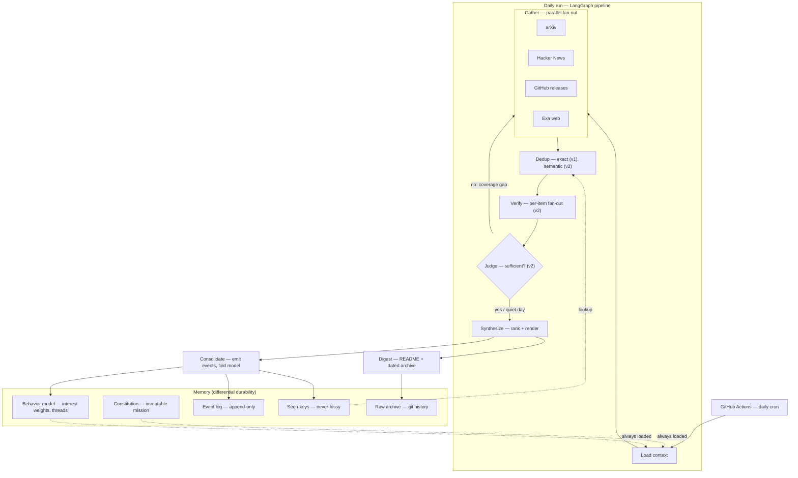
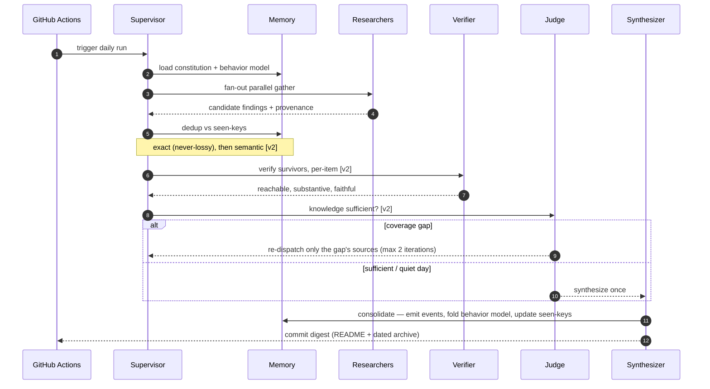

# Lodestar

A supervisor-orchestrated multi-agent system that produces a daily, high-signal digest of the agent/LLM ecosystem — and remembers what it has already shown you, how your interests evolve, and its own mission across months of use.

The digest is the visible product. The engineering interest is underneath it: a **tiered, event-sourced memory architecture** whose central property is preserving the *operational context* of a goal — evolving interests, topic threads, how the user reacted over time — intact and auditable across a year, while the underlying raw memory is aggressively compressed.

- **If you just want the digest:** it runs itself on a schedule and commits a dated, sectioned Markdown brief (this README is overwritten with the latest one).
- **If you're reading the design:** the value is in the orchestration and memory decisions — every one is deliberate, and the trade-offs are named, not hidden.

> A *lodestar* is a fixed star used for navigation. It does not move while everything around it does — which is exactly what the mission does here while memory compresses around it.

---

## Architecture

Two things are load-bearing and easy to miss:

- **The supervisor is deterministic.** It fans out gather, then routes on the judge's structured verdict. The only LLM *in the control loop* is the judge. Cognition is concentrated in evaluation; routing stays mechanical, cheap, and testable.
- **Memory is split by durability, not by age.** The mission is never compressed. The *signal* of each day is consolidated into durable structured state. Only rich raw content is compressible — and even that is never deleted (it lives in git forever). Compression touches what gets *loaded into context*, never the source of truth.

---

## How a daily run works

The judge gates on the **knowledge**, not on a finished digest — so synthesis runs exactly once, at the end. Sufficiency means *"did we sweep the sources properly?"*, not *"did we hit a quota?"* — a quiet day with two excellent items is a complete digest, not a failure.

---

## The memory model

The differentiator. "Keep the goal string" is trivial; keeping the goal's *operational context* intact under long-horizon compression is not. Four ideas do the work:

| Tier | What it holds | Durability |
|------|---------------|-----------|
| **Constitution** | mission, constraints, interest profile | immutable; human-edit only; **never compressed**; re-injected verbatim, high-salience, every run |
| **Behavior model** | interest weights, engagement aggregates, bounded topic threads | durable; updated by incremental **fold**, never free-text-summarized; size is `O(topics)`, not `O(days)` |
| **Event log** | every change — what, when, why | append-only, immutable; the behavior model is a materialized view of it |
| **Seen-keys** | URLs / content-hashes | never lossy; guarantees no-repeat over any horizon, cheaply |
| **Raw archive** | full daily digests | permanent, in git; retrieved on demand |

Three guarantees fall out of this:

1. **No-repeat forever** — a tiny, never-lossy index of seen keys, independent of any compression.
2. **A year of behavior in constant space** — each day is *consolidated* (like human episodic to semantic memory): you increment counters and decay weights instead of storing 365 logs, so the signal survives even after the raw content leaves the window.
3. **Explainability by construction** — every change is an event recording its cause (`"3 likes -> weight 0.87 to 0.91, rule engagement_decay@v2"`), and changes use deterministic rules — so "what changed and why?" is always answerable, and you can reconstruct the interest profile as of any past date.

Feedback (thumbs up/down) refines the behavior model's taste layer — **never** the immutable mission. Taste evolves; the mission doesn't drift.

---

## Patterns

| Pattern | Where | Problem it solves |
|---------|-------|-------------------|
| Orchestrator–worker | `supervisor.py`, `graph.py` | breadth-first parallel gathering with per-source context isolation |
| Deterministic router, LLM-only-in-judge | `supervisor.py`, `agents/judge.py` | routing is cheap and testable; cognition lives in evaluation |
| Fan-out + conflict-free reducers | `state.py` | concurrent-safe accumulation from parallel branches without lost writes |
| Event sourcing | `memory/events.py` | auditable what/when/why; idempotent, rebuildable state; retry-safe |
| Consolidation (episodic to structured) | `memory/behavior_model.py` | remember a year of behavior in `O(topics)`, not `O(days)` |
| Differential durability | `memory/*` | mission never compressed; raw kept forever; only regenerable caches are lossy |
| Watermark + seen-keys | `sources/*`, `memory/seen_keys.py` | efficient incremental fetch (watermark) with guaranteed no-repeat (seen-keys) |
| Credibility as booster, not gate | `credibility.py` | weight credible authors up without silencing a good insight from an unknown |
| Adapter seam | `sources/base.py` | add a source = one file; swap a fixture adapter for reproducible evals |
| Model tiering | across | cheap model on the high-volume per-item loop, strong model where quality counts |

---

## Key decisions and trade-offs

Built to be *sufficient now with a clear path later*, not perfect on day one. The notable calls:

- **Multi-agent is justified, not assumed.** It costs roughly `15x` the tokens of a single chat (Anthropic's own measurement), so it is earned *specifically* by parallel source breadth + context isolation + an adversarial verifier — not used as a default. A hard token/iteration budget is a first-class control.
- **The judge is treated with suspicion.** Kept separate from the workers and the supervisor, given a structured rubric, and never trusted alone — a hard `max_iterations` cap and token budget are the real backstops. For a digest, the cost asymmetry favors *shipping* over *chasing completeness*, so the design biases toward termination.
- **The verifier is scoped to what a digest needs** — reachability, hype-vs-substance, and faithfulness of our own one-line summaries — not generic claim-checking inherited from research systems.
- **Compaction is demoted to a cache.** Lossy summaries are never the source of truth; anything lost is re-derivable from the permanent raw archive. The guarantee lives in durable structured state, not in an LLM summarizer.
- **Control is deterministic; the LLM is for cognition.** Routing, weight updates, dedup, and consolidation are deterministic and event-logged. The LLM does research, verification, sufficiency, and synthesis. This lowers cost and non-determinism and makes the system testable.
- **Live web for the product, fixed corpus for the eval.** The same pipeline runs against a fixture adapter for reproducible evaluation — the source adapter seam makes this free.
- **Honest evaluation.** We can measure *precision* (of what we showed, how good was it?) but not *recall* (we never see what we missed). The memory-continuity proof separates cheap invariant assertions from the genuinely uncertain quality it measures. The honesty is part of the result.

Deferred on purpose: semantic memory and embeddings, the adversarial verifier and judged loop, feedback-driven folding, goal-anchored compaction, a mid-run checkpointer, and additional delivery surfaces (email/Slack). See the roadmap.

---

## Tech stack

- **Orchestration:** LangGraph (`StateGraph`, reducers, conditional edges) — confined to a thin orchestration boundary; domain logic is plain, testable Python.
- **LLM:** Claude, model-tiered — a fast model (Haiku-class) for the high-volume per-item loop, a stronger model (Sonnet-class) for synthesis and the judge.
- **Search / sources:** Exa (neural web search) behind a `SearchProvider` seam; arXiv, Hacker News, and GitHub releases via dedicated adapters.
- **Memory:** SQLite for the event log, seen-keys, and behavior model; git for the permanent raw archive; embeddings (Voyage) for semantic memory in a later phase.
- **Scheduling / delivery:** GitHub Actions (scheduled workflow, commit-back) — free for public repos, and the daily commit itself keeps the workflow alive.
- **Dev:** `ruff`, `black`, `pytest`; config as versioned YAML.

---

## Roadmap

- **Phase 0 — Walking skeleton:** one source to committed digest via a scheduled Action. Proves the deployment path end to end.
- **Phase 1 — Useful daily digest:** all sources, never-lossy dedup, credibility-weighted sectioned ranking, event log recording from day one, deterministic evals in CI.
- **Phase 2 — Intelligence and evolving memory:** adversarial verifier, judged loop with targeted re-dispatch, feedback-driven behavior model, semantic memory and dedup.
- **Phase 3 — The memory thesis, proven:** goal-anchored compaction cache and a reproducible year-long continuity eval — the headline result.
- **Phase 4 — Stretch:** procedural memory, more delivery surfaces, a Postgres backend, contradiction detection.

---

## Status

Phase 1 in progress — the daily pipeline runs on schedule over arXiv, Hacker News, and GitHub releases (Exa web once a key is added), with never-lossy dedup, credibility-weighted sectioned ranking, and an append-only event log. Sections marked `[v2]` (verifier, judged loop, semantic memory) land in later phases.

**Today's digest** is written to [`latest.md`](latest.md) and archived under [`digests/`](digests/); per-run metrics land in [`runs/`](runs/). This README stays the architecture overview.

## License

MIT.
